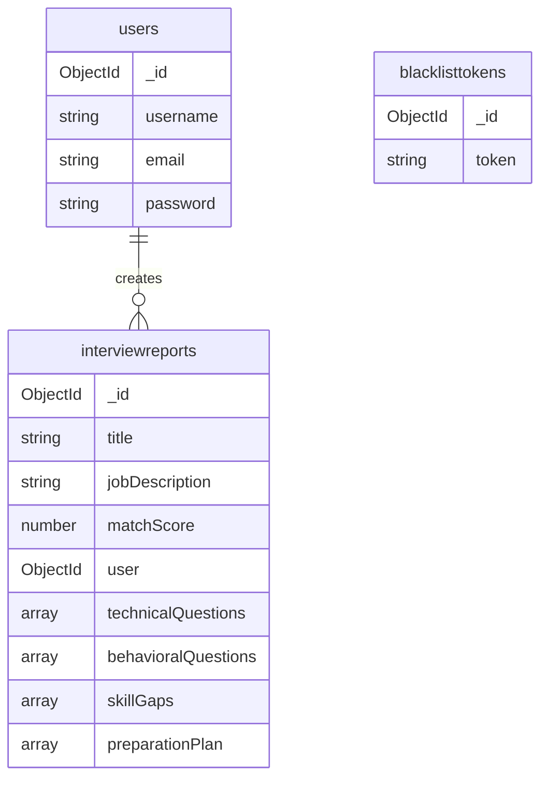

The Resume Generator uses MongoDB as its database to store user accounts, interview reports, and authentication tokens. This guide covers MongoDB setup and the application's data models.

## MongoDB Installation

<Steps>
  <Step title="Choose your MongoDB deployment">
    You can use either:
    - **MongoDB Atlas** (cloud-hosted, recommended for production)
    - **Local MongoDB** (self-hosted, good for development)
  </Step>
  
  <Step title="Install MongoDB (Local Option)">
    For local development, install MongoDB Community Edition:
    
    **macOS**:
    ```bash
    brew tap mongodb/brew
    brew install mongodb-community
    brew services start mongodb-community
    ```
    
    **Linux (Ubuntu/Debian)**:
    ```bash
    sudo apt-get install mongodb-org
    sudo systemctl start mongod
    sudo systemctl enable mongod
    ```
    
    **Windows**:
    Download and install from [MongoDB Download Center](https://www.mongodb.com/try/download/community)
  </Step>
  
  <Step title="Create Database (Local)">
    MongoDB will automatically create the database on first connection. The default name is based on your `MONGO_URI`:
    ```bash
    # Database will be created automatically
    # Default: resume-generator
    ```
  </Step>
  
  <Step title="Set up MongoDB Atlas (Cloud Option)">
    1. Create a free account at [MongoDB Atlas](https://www.mongodb.com/cloud/atlas)
    2. Create a new cluster
    3. Add a database user with read/write permissions
    4. Whitelist your IP address (or use 0.0.0.0/0 for development)
    5. Get your connection string from the "Connect" button
  </Step>
  
  <Step title="Configure connection string">
    Add your MongoDB URI to `.env`:
    ```bash
    # Local MongoDB
    MONGO_URI=mongodb://localhost:27017/resume-generator
    
    # MongoDB Atlas
    MONGO_URI=mongodb+srv://<username>:<password>@cluster.mongodb.net/resume-generator
    ```
  </Step>
</Steps>

## Database Connection

The application establishes a database connection using Mongoose in `src/config/database.js`:

```javascript
const mongoose = require("mongoose")

async function connectToDB() {
    try {
        await mongoose.connect(process.env.MONGO_URI)
        console.log("Connected to Database")
    }
    catch (err) {
        console.log(err)
    }
}

module.exports = connectToDB
```

The connection is initialized in `server.js` before starting the Express server.

## Database Schema

### User Model

Stores user account information for authentication.

**Location**: `src/models/user.model.js`

**Schema Structure**:

<ParamField path="username" type="string" required>
  Unique username for the user account
  - Must be unique across all users
  - Error message: "username already taken"
</ParamField>

<ParamField path="email" type="string" required>
  User's email address
  - Must be unique across all users
  - Used for login authentication
  - Error message: "Account already exists with this email address"
</ParamField>

<ParamField path="password" type="string" required>
  Hashed password (bcrypt with 10 salt rounds)
  - Never stored in plain text
  - Hashed before saving to database
</ParamField>

**Collection Name**: `users`

**Example Document**:
```json
{
  "_id": "507f1f77bcf86cd799439011",
  "username": "johndoe",
  "email": "john@example.com",
  "password": "$2a$10$N9qo8uLOickgx2ZMRZoMye..."
}
```

### Interview Report Model

Stores AI-generated interview preparation reports for users.

**Location**: `src/models/interviewReport.model.js`

**Schema Structure**:

<ParamField path="title" type="string" required>
  Job title for which the interview report was generated
</ParamField>

<ParamField path="jobDescription" type="string" required>
  The job description provided by the user
</ParamField>

<ParamField path="resume" type="string">
  Resume text content (optional if resume file was uploaded)
</ParamField>

<ParamField path="selfDescription" type="string">
  User's self-description or cover letter
</ParamField>

<ParamField path="matchScore" type="number">
  AI-calculated score (0-100) indicating job match quality
</ParamField>

<ParamField path="technicalQuestions" type="array">
  Array of technical interview questions
  
  Each question contains:
  - `question` (string, required): The interview question
  - `intention` (string, required): Why the interviewer asks this
  - `answer` (string, required): How to answer effectively
</ParamField>

<ParamField path="behavioralQuestions" type="array">
  Array of behavioral interview questions
  
  Each question contains:
  - `question` (string, required): The interview question
  - `intention` (string, required): Why the interviewer asks this
  - `answer` (string, required): How to answer effectively
</ParamField>

<ParamField path="skillGaps" type="array">
  Identified gaps between user skills and job requirements
  
  Each skill gap contains:
  - `skill` (string, required): The missing or weak skill
  - `severity` (enum, required): "low", "medium", or "high"
</ParamField>

<ParamField path="preparationPlan" type="array">
  Day-by-day interview preparation plan
  
  Each day contains:
  - `day` (number, required): Day number (starting from 1)
  - `focus` (string, required): Main focus area for the day
  - `tasks` (array of strings, required): Specific tasks to complete
</ParamField>

<ParamField path="user" type="ObjectId" required>
  Reference to the user who created this report
  - References the `users` collection
</ParamField>

<ParamField path="timestamps" type="object">
  Automatically managed timestamps
  - `createdAt`: When the report was generated
  - `updatedAt`: When the report was last modified
</ParamField>

**Collection Name**: `interviewreports`

**Example Document**:
```json
{
  "_id": "507f1f77bcf86cd799439012",
  "title": "Senior Full Stack Developer",
  "jobDescription": "We are seeking a Senior Full Stack Developer...",
  "resume": "Experienced software engineer with 5+ years...",
  "selfDescription": "Passionate developer with expertise in...",
  "matchScore": 85,
  "technicalQuestions": [
    {
      "question": "Explain the difference between REST and GraphQL",
      "intention": "Assess understanding of API design patterns",
      "answer": "REST is resource-based while GraphQL is query-based..."
    }
  ],
  "behavioralQuestions": [...],
  "skillGaps": [
    {
      "skill": "Kubernetes",
      "severity": "medium"
    }
  ],
  "preparationPlan": [
    {
      "day": 1,
      "focus": "System Design Fundamentals",
      "tasks": [
        "Review microservices architecture patterns",
        "Practice designing a URL shortener"
      ]
    }
  ],
  "user": "507f1f77bcf86cd799439011",
  "createdAt": "2024-03-15T10:30:00.000Z",
  "updatedAt": "2024-03-15T10:30:00.000Z"
}
```

### Token Blacklist Model

Stores invalidated JWT tokens (e.g., after logout) to prevent reuse.

**Location**: `src/models/blacklist.model.js`

**Schema Structure**:

<ParamField path="token" type="string" required>
  The JWT token that has been invalidated
  - Added when users log out
  - Checked during authentication to reject blacklisted tokens
</ParamField>

<ParamField path="timestamps" type="object">
  Automatically managed timestamps
  - `createdAt`: When the token was blacklisted
  - `updatedAt`: When the record was last modified
</ParamField>

**Collection Name**: `blacklisttokens`

**Example Document**:
```json
{
  "_id": "507f1f77bcf86cd799439013",
  "token": "eyJhbGciOiJIUzI1NiIsInR5cCI6IkpXVCJ9...",
  "createdAt": "2024-03-15T14:20:00.000Z",
  "updatedAt": "2024-03-15T14:20:00.000Z"
}
```

## Database Relationships



## Database Indexing

The application automatically creates indexes on:
- `users.username` (unique)
- `users.email` (unique)
- `interviewreports.user` (reference)

## Troubleshooting

<AccordionGroup>
  <Accordion title="Connection timeout errors">
    - Verify MongoDB is running: `sudo systemctl status mongod`
    - Check firewall settings allow port 27017
    - For Atlas, verify IP whitelist includes your current IP
    - Test connection using MongoDB Compass
  </Accordion>
  
  <Accordion title="Duplicate key errors">
    - Username or email already exists in database
    - Clear test data if in development: `db.users.deleteMany({})`
    - Check for duplicate entries before insertion
  </Accordion>
  
  <Accordion title="Authentication failures">
    - Ensure MongoDB user has `readWrite` role
    - Verify credentials in connection string
    - Check database name matches your configuration
  </Accordion>
  
  <Accordion title="Schema validation errors">
    - Review required fields in error messages
    - Ensure data types match schema definitions
    - Check enum values for `skillGaps.severity`
  </Accordion>
</AccordionGroup>

## Database Management

### Using MongoDB Shell

Connect to your database:
```bash
mongosh "mongodb://localhost:27017/resume-generator"
```

Common commands:
```javascript
// List all collections
show collections

// View users
db.users.find()

// View interview reports
db.interviewreports.find()

// Count documents
db.users.countDocuments()

// Delete all data (development only)
db.users.deleteMany({})
db.interviewreports.deleteMany({})
db.blacklisttokens.deleteMany({})
```

### Using MongoDB Compass

MongoDB Compass provides a GUI for database management:
1. Download from [MongoDB Compass](https://www.mongodb.com/products/compass)
2. Connect using your `MONGO_URI`
3. Browse collections and documents visually
4. Create indexes and run queries

## Next Steps

<CardGroup cols={2}>
  <Card title="Environment Variables" icon="gear" href="/configuration/environment-variables">
    Configure all required environment variables
  </Card>
  <Card title="AI Setup" icon="brain" href="/configuration/ai-setup">
    Set up Google Gemini API for AI features
  </Card>
</CardGroup>